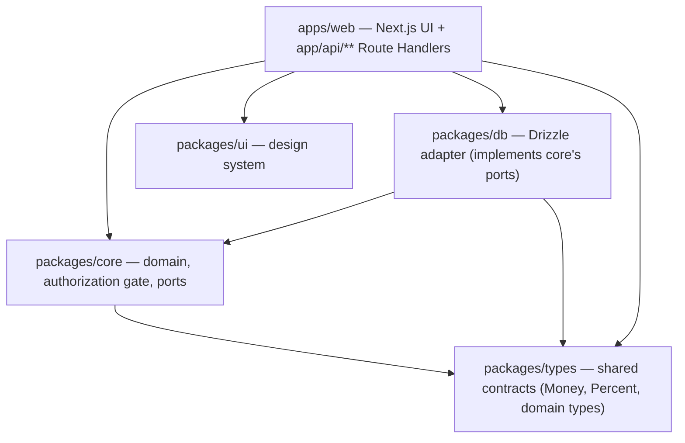
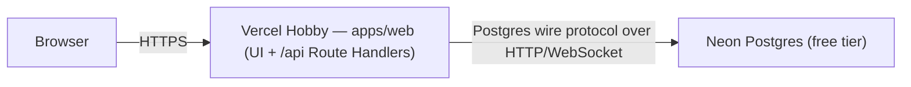
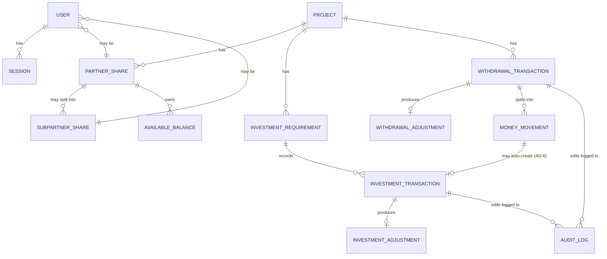

# Architecture Spine — NiveshBook

## Design Paradigm

**Hexagonal (Ports & Adapters) with a shared domain core.**

`packages/core` is the domain: money math (Should Pay, carry-forward adjustments, withdrawal entitlements), the authorization gate, and the ports (interfaces) it needs — a persistence port and a session-store port. Nothing under `packages/core` imports a database driver or an HTTP framework.

`apps/web` (Next.js) is the driving adapter: its Route Handlers translate HTTP requests into calls against `packages/core`'s domain functions and render the UI. `packages/db` is the driven adapter: it implements `packages/core`'s ports against Postgres via Drizzle. This keeps the money-math and privacy rules — the parts most likely to be read, tested, and reused independently of any one deployment shape — free of framework and driver concerns.



## Invariants & Rules

### AD-1 — One canonical authorization gate, including for lists

- **Binds:** FR-7, FR-8, FR-9, FR-10, FR-11, FR-45; every Route Handler, including list/report/export endpoints (Money History, Dashboards, Reports).
- **Prevents:** a route hand-rolling its own access check; a builder inventing an ad-hoc "which project IDs can this user see" filter for a list endpoint instead of using the same gate a single-resource check uses; `authorize()` reading a stale permission snapshot cached on the session row instead of live data.
- **Rule:** Every `app/api/**/route.ts` handler calls `packages/core`'s `authorize()` before touching data. `authorize()` has two forms: `authorize(actor, action, resourceRef)` for a single resource, and `authorizeScope(actor, action, resourceType)` for a list/report/export — the latter returns the filter (e.g. permitted project/partner/sub-partner IDs) the caller must apply to its query, not just a boolean. FR-11's optional Partner→Sub-partner visibility grant is evaluated *inside* `authorize()`/`authorizeScope()` — never as a separate check bolted on after. Both forms always re-read live permission/role data (via the session port, AD-8) on every call; neither may read a role or grant cached on the `sessions` row. A request failing either form returns 403 with no response body beyond a generic error — never a partial result. `[ADOPTED — PRD FR-7/FR-8]`

### AD-2 — Money is exact end-to-end, one arithmetic module, one rounding rule

- **Binds:** every monetary and percentage field (Should Pay, Paid Now, Can Take, all Adjustments, Available Balance); any calculation that splits an amount across several people by percentage.
- **Prevents:** float rounding errors; two builders picking different money representations; per-person split amounts that don't sum back to the total (e.g. 33.3333% × 3 people); the exact bug already found in the brownfield demo scaffold (`Money.amount: number`); a `Money`-shaped value silently produced via `Number()`/`parseFloat` arithmetic instead of decimal-safe math.
- **Rule:** Amounts are stored as Postgres `NUMERIC`, and cross a **nominally-branded** `Money` value type in `packages/types` (not a structural `{value: string}` shape — a real/opaque brand so a plain object can't satisfy the type by accident) at every boundary — DB row, domain function, API response, UI prop. All money and percentage arithmetic goes through one designated module (`packages/core/src/decimal-math.ts`) — no other file performs `+`/`-`/`*` on a monetary value directly. An eslint rule bans `parseFloat`, `parseInt`, and `Number()` applied to monetary values anywhere in `packages/core` and `packages/db` outside that module. When a percentage split across several people doesn't divide evenly, the remainder is allocated by the **largest-remainder method**, applied identically by every capability that does a percentage split (Add Money's Should Pay, Withdraw Money's Can Take) — never a per-feature ad-hoc rounding choice. Percentages store at least 4 decimal digits (supports 33.3333%).

### AD-3 — Ownership Share is a distinct, column-scoped, versioned value

- **Binds:** the `sharePercent` column on `PARTNER_SHARE`/`SUBPARTNER_SHARE` (PRD §4.3; Glossary "Share %"); Add Money (FR-15–FR-20) and Withdraw Money (FR-21–FR-26) as its two read-only consumers.
- **Prevents:** an investment- or withdrawal-adjustment code path ever writing to `sharePercent`, even indirectly; a later Share % edit silently rewriting the interpretation of a past funding round's Should Pay; a modeling accident where the Privacy capability (FR-11's visibility-grant flag, if stored on the same row) is blocked from writing its own column by a rule meant only for the percentage.
- **Rule:** the constraint is scoped to the `sharePercent` column specifically, not the whole table — other columns on the same row (e.g. a visibility-grant flag) are owned by their respective capability. `sharePercent` is **immutable once set for a given effective period**: changing a Partner's or Sub-partner's share creates a new versioned row with an effective-from date rather than overwriting the old value in place. Every Investment or Withdrawal transaction snapshots the `sharePercent` value effective at the moment Should Pay / Can Take was computed onto the transaction row itself — the transaction never recomputes its own historical share from the current `PARTNER_SHARE` state.

### AD-4 — Investment Adjustment and Withdrawal Adjustment are separate ledgers, keyed by share, not by login

- **Binds:** FR-18, FR-19, FR-23, FR-24, FR-33, FR-34.
- **Prevents:** any code path reading one ledger to compute or silently offset the other; two builders each keying their ledger to a different identity (a `USER` login vs. a `PARTNER_SHARE`/`SUBPARTNER_SHARE` record) and breaking the Adjust Next Time page's join between them — a real risk since a Sub-partner may hold a share with no login yet (per the ER diagram's `USER }o--|| PARTNER_SHARE "may be"`).
- **Rule:** two distinct tables (`investment_adjustments`, `withdrawal_adjustments`), each keyed by `(shareId, projectId)` — where `shareId` is the `PARTNER_SHARE.id` or `SUBPARTNER_SHARE.id`, never `USER.id`. A person without a login yet can still accrue adjustment history against their share record; a login, when created, links to the existing share rather than the ledger re-keying to it. A netting operation between the two ledgers is its own explicit, audited transaction type — never a side effect of either cycle's calculation. `[ADOPTED — PRD FR-34]`

### AD-5 — Every financial write is one audited, transactional, idempotent mutation

- **Binds:** FR-41, FR-42; all money-moving capabilities.
- **Prevents:** silent edits; partially-applied multi-record writes; a double form-submit or retried request creating two valid, individually-correct, individually-audited records for the same action.
- **Rule:** every create/edit to a financial record runs inside a single DB transaction that also writes an `audit_log` row (actor, timestamp, old value, new value, reason). Every financial-write endpoint requires a client-generated idempotency key; the key is stored with a unique constraint, and a repeated request with the same key returns the original result rather than creating a second record. "Delete" is implemented only as `status: cancelled` plus a linked reversal record — no `DELETE` statement ever targets a financial table. Reversing any record that was created as part of a multi-record bundle (AD-6) cascades to every record in that bundle — never leaves an orphaned sibling.

### AD-6 — Withdrawal-to-Project movement is one atomic, composable operation, not three separate entries

- **Binds:** FR-27, FR-28.
- **Prevents:** a UI flow (or a second builder) re-entering the same amount as a fresh, unlinked investment in the destination project; a multi-destination withdrawal split (FR-27: project + person + Available Balance in one save) partially committing because one leg's transaction is separate from the others.
- **Rule:** a single `moveWithdrawalToProject()` function in `packages/core` creates the withdrawal, the money-movement record, and the destination-project investment record. This function **accepts and participates in a caller-supplied transaction** — it never opens its own — so that FR-27's multi-destination split (which may call this function for one leg while writing the person-transfer and Available-Balance legs in the same save) commits or rolls back as a single unit. No other code path may create this specific three-record combination.

### AD-7 — Client differences are configuration, never a code branch

- **Binds:** FR-43, FR-44.
- **Prevents:** an `if (clientId === 'x')` appearing anywhere in `packages/core` or `apps/web`.
- **Rule:** one `client.config` object, resolved from environment variables at boot, supplies branding, currency/locale, and enabled-modules. `packages/core` never imports or branches on a client identifier — client identity is a fact `apps/web` and `packages/db` know, `packages/core` does not.

### AD-8 — Sessions are server-side, Postgres-backed, and immediately revocable

- **Binds:** FR-1, FR-5.
- **Prevents:** a stateless JWT that can't be revoked short of a denylist workaround, and a second free-tier service (Redis) the free-infra constraint doesn't need.
- **Rule:** a `sessions` table holds a hashed opaque token with an expiry; every request validates against this table through the session port; deleting the row ends the session on the very next request.

### AD-9 — Dependency direction is one-way: adapters depend on the core, never the reverse

- **Binds:** all packages.
- **Prevents:** a Route Handler importing `packages/db` directly instead of going through `packages/core`; `packages/core` acquiring a dependency on `apps/web`, `packages/db`, or a specific database driver.
- **Rule:** `apps/web` may import from `packages/core`, `packages/db`, `packages/ui`, `packages/types`. `packages/db` may import from `packages/core` and `packages/types` only. `packages/core` may import from `packages/types` only — never from `apps/*` or `packages/db`. Enforced by a dependency-direction lint rule (e.g. dependency-cruiser). Note the scope of what this catches: it enforces *import direction*, not logic duplication — it cannot by itself catch a Route Handler that imports `packages/core` correctly for one call while also inlining a second, divergent copy of the same calculation. That failure mode is a code-review discipline, not something a lint rule alone closes.

### AD-10 — Concurrent writes to a shared balance never lose an update

- **Binds:** FR-29 (Available Balance); any other shared mutable numeric aggregate a future feature adds.
- **Prevents:** two concurrent requests both reading the same balance, both deducting from it, and one update silently overwriting the other — producing a negative or simply wrong balance even though each individual transaction was internally correct (Postgres's default READ COMMITTED isolation does not prevent this on its own).
- **Rule:** every balance-decrementing mutation takes a row lock (`SELECT ... FOR UPDATE`) on the balance row inside its transaction before checking sufficiency and writing the new value. A Postgres `CHECK` constraint enforcing `balance >= 0` is a backstop, not a substitute for the row lock — the two are complementary.

## Consistency Conventions

| Concern | Convention |
| --- | --- |
| Naming (entities, files, interfaces, events) | DB tables/columns: `snake_case`. TypeScript: `camelCase`. Domain identifiers mirror PRD Glossary terms verbatim (`shouldPay`, `extraPaid`, `keepForLater`, `availableBalance`) so code and product vocabulary never drift apart. |
| Data & formats (ids, dates, error shapes, envelopes) | IDs: UUID v7 (time-ordered) on every table. Money: `NUMERIC` in Postgres, `Money` value type (string-backed) everywhere else — never `number`. Dates: ISO 8601 strings at every boundary. API errors: `{ code: string, message: string }`, never a raw stack trace to the client. |
| State & cross-cutting (mutation, errors, logging, config, auth) | All financial mutations go through a `packages/core` service function — no Route Handler calls Drizzle directly for a write. Every mutation is wrapped in one DB transaction (AD-5). `client.config` (AD-7) is the only source of per-client variance. `authorize()` (AD-1) is the only source of permission decisions. |

## Stack

| Name | Version |
| --- | --- |
| Next.js | 16.2.10 (verified current 2026-09-22; brownfield scaffold was on 14.2.15 — upgrading now while only demo code exists) |
| React | ^19 (paired with Next.js 16) |
| TypeScript | ^5.6.3 (existing pin, still current) |
| Drizzle ORM | ^0.45.3 (verified current 2026-09-22) |
| @neondatabase/serverless | ^1.1.0 (verified current 2026-09-22; HTTP/WebSocket driver, required for Vercel's serverless runtime) |
| PostgreSQL | 17 (Neon-hosted) |
| Vercel Hobby | free tier — hosting for `apps/web` (UI + API Route Handlers) |
| Neon | free tier — Postgres, scales to zero |

## Structural Seed

```text
{root}/
  apps/
    web/                    # Next.js 16 App Router — UI + app/api/** Route Handlers (replaces apps/api entirely)
  packages/
    core/                   # domain: money math, adjustment carry-forward, authorize() gate, ports (no DB/HTTP imports)
    db/                     # Drizzle schema + Postgres adapter implementing core's ports (the only package with a DB driver)
    types/                  # shared contracts: Money, Percent, domain entity types (replaces demo Portfolio/Investment types)
    ui/                     # design system components (chosen theme direction from the mockup review)
    config/                 # shared eslint/tsconfig — unchanged
```

`apps/api` (Fastify) is retired, not migrated — its one demo route carried no real logic worth keeping.





## Capability → Architecture Map

| Capability / Area | Lives in | Governed by |
| --- | --- | --- |
| Accounts, Roles & Access Control (FR-1–FR-8, FR-45) | `packages/core` (authorize gate, session port) + `apps/web/app/api/auth/**` | AD-1, AD-8 |
| Partner & Sub-partner Privacy (FR-9–FR-11) | `packages/core` (authorize gate) | AD-1 |
| Project Creation & Partner Shares (FR-12–FR-14) | `packages/core` + `packages/db` schema | AD-3 |
| Add Money (FR-15–FR-20) | `packages/core` calculation engine | AD-2, AD-3, AD-4, AD-5 |
| Withdraw Money (FR-21–FR-26) | `packages/core` calculation engine | AD-2, AD-3, AD-4, AD-5 |
| Money Destination, Movement & Available Balance (FR-27–FR-30) | `packages/core` (`moveWithdrawalToProject`) | AD-5, AD-6, AD-10 |
| Money History (FR-31–FR-32) | `apps/web` read views + `packages/db` queries | AD-1, AD-5 |
| Adjust Next Time (FR-33–FR-34) | `packages/core` | AD-4, AD-5 |
| Dashboards (FR-35–FR-37) | `apps/web` + `packages/ui` | AD-1 |
| Reports (FR-38–FR-40) | `apps/web/app/api/reports/**` | AD-1 |
| Audit History (FR-41–FR-42) | `packages/db` (`audit_log`) + `packages/core` | AD-5 |
| Productization & Client Configuration (FR-43–FR-44) | `apps/web` (`client.config`) | AD-7 |

## Deferred

- **Multi-tenant vs. per-client-deployment** — revisit if a second paying client is confirmed before this ships; the rejected-alternative rationale already lives in the PRD addendum.
- **`packages/ui` design tokens** — resolved: a clean SaaS-dashboard direction (light cool-grey canvas, white cards, blue primary accent, green/red/teal/violet status chips) per the user's reference mockup; still needs a final token pass (exact hex/spacing scale) when `packages/ui` is actually built.
- **Project Admin role, go/no-go for v1** — PRD Open Question 2; left supported-but-unconfirmed, a call for Epics/Sprint Planning, not Architecture.
- **CI/CD pipeline and test framework choice** (Vitest vs. Jest, GitHub Actions config) — mechanical, not load-bearing at this scale; deferred to build setup.
- **Observability/logging provider beyond Vercel's built-in logs** — unnecessary at free-tier, single-client scale; revisit alongside the multi-tenant trigger above.
- **Rate limiting / abuse protection** — deferred; v1 has no self-serve signup surface to abuse. Revisit if self-serve onboarding ever ships (currently a Non-Goal).
